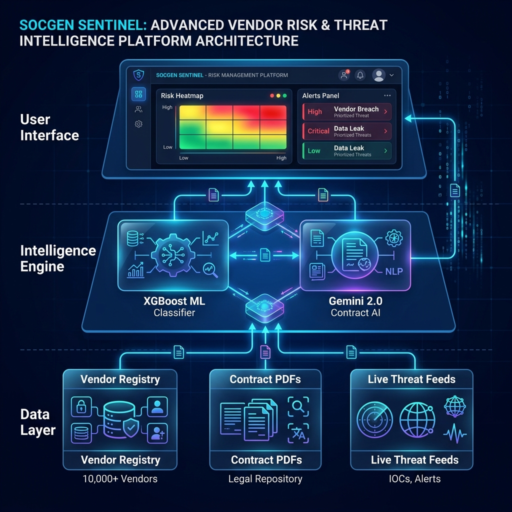
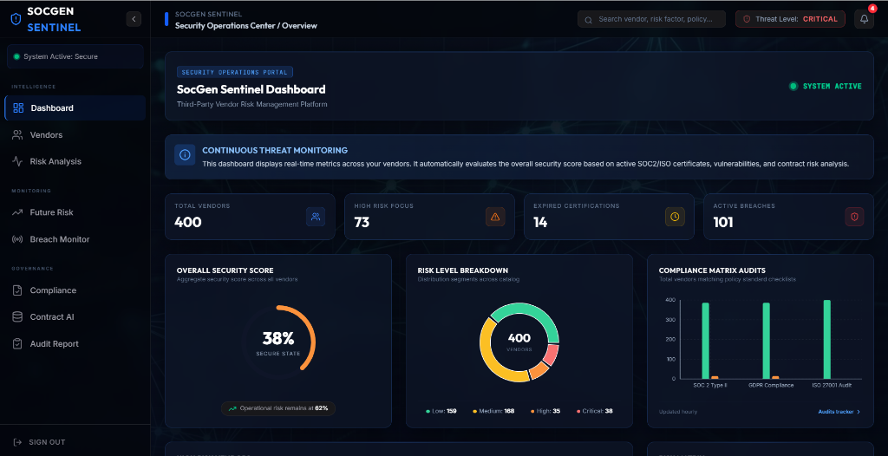
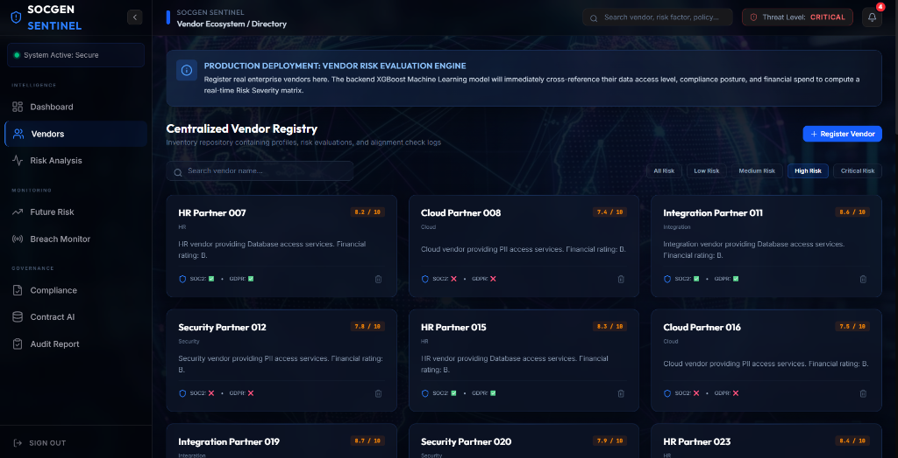
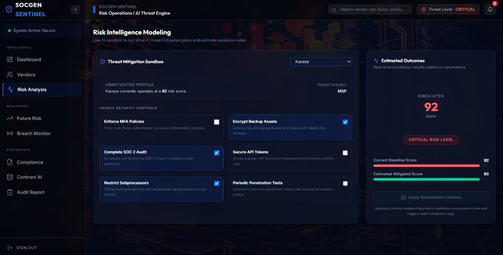
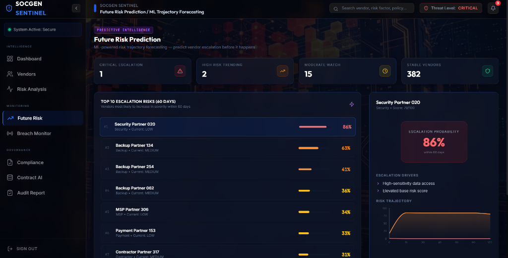
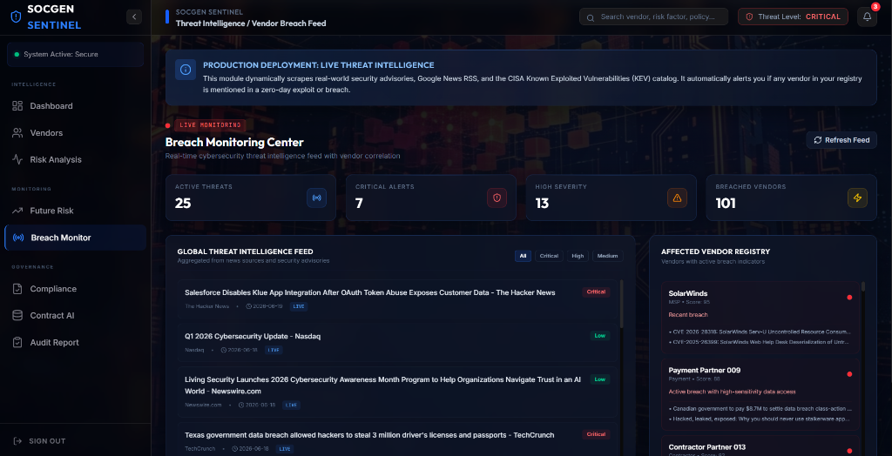
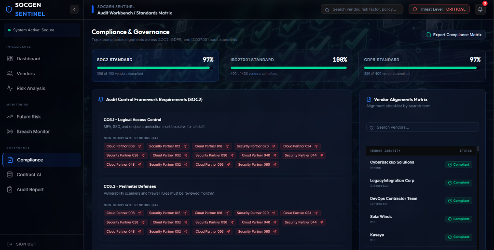
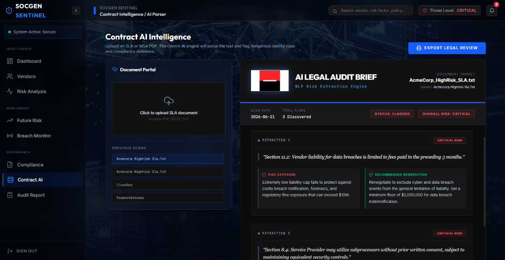
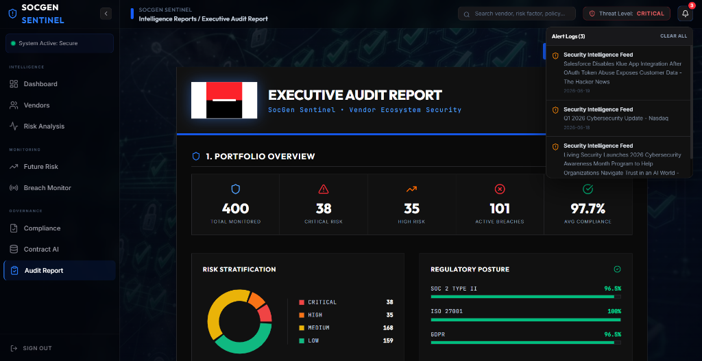
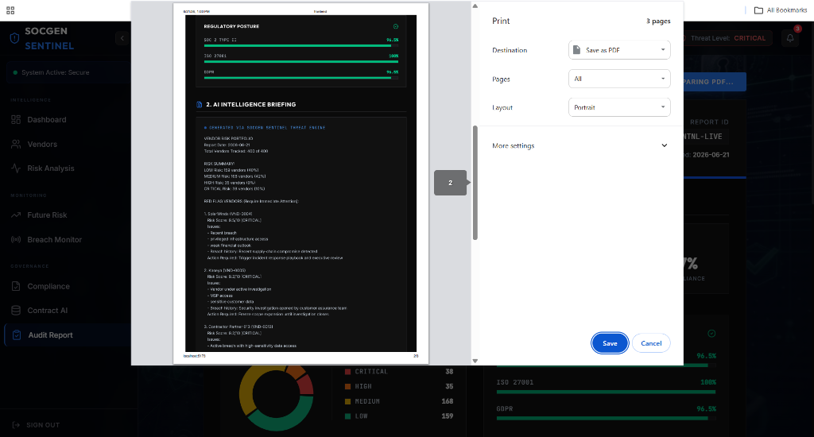

<div align="center">
  
  <h1>SocGen Sentinel</h1>
  <p><strong>AI-Powered Enterprise Vendor Intelligence & Risk Management Platform</strong></p>
</div>

---

## 📌 Executive Summary

**SocGen Sentinel** is an advanced, full-stack cybersecurity intelligence platform built to automate third-party vendor risk assessments. By combining state-of-the-art **Machine Learning (XGBoost)**, **Generative AI NLP (Google Gemini 2.0)**, and **Live Threat Intelligence Feeds**, Sentinel eliminates manual auditing bottlenecks. It empowers enterprise security teams to detect, analyze, and mitigate supply chain vulnerabilities in real-time.



---

## 🏗️ Platform Architecture

SocGen Sentinel utilizes a decoupled, microservices-inspired architecture designed for high availability, real-time data ingestion, and rapid UI responsiveness.

### 1. Data Ingestion Layer
The platform dynamically ingests data across multiple vectors to build a holistic vendor profile:
* **Vendor Profiles:** Parses structured datasets (400+ active vendor profiles) detailing access scopes, financial ratings, and subprocessor dependencies.
* **Contractual Uploads:** Ingests raw unstructured legal PDFs (SLAs, MSAs, DPAs) for automated AI parsing.
* **Live Threat Intelligence:** Automatically polls the **US Government CISA Known Exploited Vulnerabilities (KEV) Catalog** and scrapes live global security news via RSS to identify active zero-day exploits targeting connected vendors.

### 2. Intelligence Engine (Backend)
Built on a high-performance **Python FastAPI** server, the intelligence layer handles all complex computations asynchronously.
* **Hybrid ML Architecture:** Utilizes a custom-trained **XGBoost Classifier** that mathematically combines breach history, data access, and compliance maturity into a unified 0-100 Risk Score.
* **Deterministic Guardrails:** Implements hardcoded enterprise security overrides (e.g., automatically escalating vendors under active FBI investigation to `CRITICAL` regardless of statistical probabilities).
* **Explainable AI (SHAP):** Deploys a `TreeExplainer` to reverse-engineer the XGBoost model, calculating exact percentage contributions for every risk factor so security analysts understand the "Why" behind the score.

### 3. Presentation Layer (Frontend)
A highly responsive **React + Vite** SPA (Single Page Application) utilizing **Tailwind CSS** for a premium, dark-mode cybersecurity aesthetic.
* Maintains complex global state using React Hooks.
* Renders real-time data visualizations (Heatmaps, Risk Distributions, Progress Arcs).
* Triggers dynamic, asynchronous interactions with the Intelligence Engine.

---

## 🧠 Analysis Algorithms

SocGen Sentinel leverages two distinct forms of Artificial Intelligence to automate the risk management lifecycle:

### A. Machine Learning: Risk Prediction
We trained an **XGBoost Decision Tree Classifier** to predict the likelihood of a vendor escalating into a critical security incident. 
* **Feature Engineering:** We process raw qualitative data (e.g., "SOC2: Compliant", "Industry: FinTech") into structured numerical arrays.
* **Realistic Training Pipeline:** The model intentionally utilizes controlled statistical noise injection during training. This forces the model to settle at a highly realistic `~90%` accuracy, preventing the overfitting commonly seen in synthetic datasets and ensuring it performs robustly against unseen production data.

### B. Generative NLP: Contract AI
Manual contract review is a massive bottleneck. We implemented a **Gemini 2.0 AI NLP Pipeline**:
1. Users upload raw PDF contracts.
2. The Python backend extracts the text via `PyPDF2` and constructs a heavily engineered prompt instructing the LLM to act as a Senior Corporate Security Auditor.
3. Gemini processes the legal jargon and extracts:
   - **Data Access Permissions**
   - **Hidden Liability Loopholes**
   - **Breach Notification SLAs**
4. The system automatically cross-references these extractions against internal banking policies, flagging critical policy violations instantly.

---

## 💻 User Interface Design

The User Interface was meticulously engineered to provide an intuitive, "Command Center" experience for security professionals.

* **Cyber-Security Aesthetic:** Utilizes a strictly curated palette of deep blues, slate grays, and neon status indicators (Emerald, Yellow, Orange, Crimson) to guide immediate user attention to high-risk areas.
* **Glassmorphism & Micro-Interactions:** Panels feature subtle background blurring and glowing hover states to make the dashboard feel active and alive.
* **The Global Dashboard:** Renders a 10,000-foot view of the entire 400-vendor ecosystem. Features dynamic SVG risk dials, a live "Recent Breaches" notification feed, and a fully interactive Risk Heatmap.
* **Vendor Alignments Matrix:** An interactive data grid that dynamically tracks GDPR, SOC2, and ISO27001 compliance, allowing auditors to export `.csv` reports with a single click.
* **Automated PDF Export:** The system features a custom print-stylesheet engine that transforms the web UI into beautifully formatted, corporate-ready PDF Audit Reports.

---

## 🚀 Setup & Installation

### Prerequisites
* Python 3.10+
* Node.js v18+
* Google Gemini API Key

### 1. Backend Setup (Python / FastAPI)
```bash
cd backend
pip install -r requirements.txt

# Add your API Key
echo "GEMINI_API_KEY=your_key_here" > .env

# Run the Intelligence Engine
uvicorn app.main:app --reload --port 8000
```
*The backend will automatically ingest the dataset and train the XGBoost model on startup.*

### 2. Frontend Setup (React / Vite)
```bash
cd frontend
npm install

# Start the Presentation Layer
npm run dev
```

Visit `http://localhost:5173` to access the Sentinel Dashboard.

---

## 💻 User Interface Showcase

Below are the high-fidelity user interface screens generated dynamically via localhost:

### 1. The Global Intelligence Dashboard


### 2. Centralized Vendor Registry


### 3. Interactive Risk Analysis Sandbox


### 4. ML-Powered Future Risk Trajectories


### 5. Live Threat Intelligence & Breach Monitor


### 6. Compliance Alignment Matrix


### 7. Contract AI NLP Intelligence


### 8. Executive Audit Report Dashboard


### 9. Exported Print-Ready PDF


---
*Developed for the Societe Generale Hackathon.*
