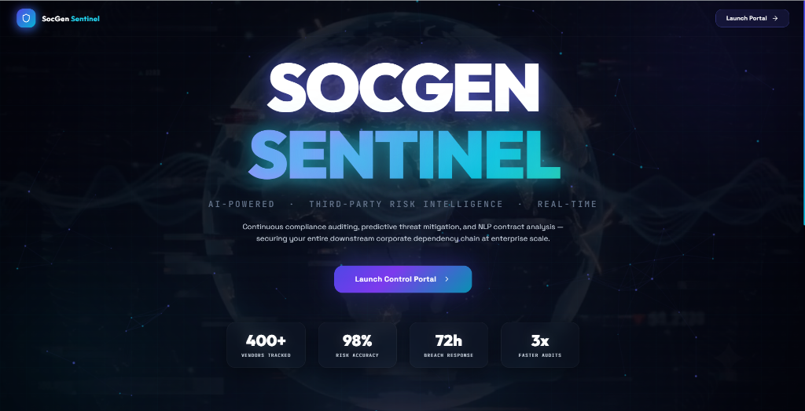

<div align="center">
  
  <h1>SocGen Sentinel</h1>
  <p><strong>AI-Powered Enterprise Third-Party Risk Intelligence Platform</strong></p>
  <br/>
  
</div>

---

## 📌 Executive Summary

**SocGen Sentinel** is an advanced third-party vendor risk intelligence platform designed for modern financial institutions. By combining **Machine Learning (XGBoost)**, **Generative AI NLP (Google Gemini)**, and **Live Threat Intelligence Feeds**, Sentinel automates vendor security auditing. It transforms manual compliance checklists and unstructured legal contracts into real-time, explainable, and actionable threat models.

---

## 🏗️ Platform Architecture

Sentinel utilizes a decoupled, high-performance architecture built for real-time reactivity and modern dark-mode aesthetics:

### 1. Data Ingestion Layer
* **Ecosystem Registry:** Ingests and profiles enterprise vendors detailing data access scopes, subprocessor networks, and compliance maturity.
* **Contract Processing:** Ingests raw unstructured legal PDFs (SLAs, MSAs) for automated parsing.
* **Live Threat Intelligence:** Scrapes live global security news feeds and cross-references them with the vendor registry to identify zero-day exposures.

### 2. Backend Intelligence Server (Python FastAPI)
* **XGBoost Classifier Model:** Computes a unified 0-100 Risk Score based on breach history, data access levels, and security posture.
* **Explainable AI (SHAP):** Calculates exact contribution percentages for every risk factor using a SHAP `TreeExplainer`, detailing the exact "Why" behind the machine learning outputs.
* **Deterministic Guardrails:** Implements high-priority enterprise overrides for compliance and threat response.

### 3. Presentation Layer (React + Vite + Tailwind CSS)
* **Sleek Cyber-Dashboard Aesthetic:** Designed with vibrant HSL-tailored colors, neon active states, glassmorphic panels, and glowing gradient highlights.
* **Immersive Welcome Landing Page:** Features a fixed cinematic video background (`homebg.mp4`), dynamic radial contrast vignettes, and interactive particle connections.
* **Independent Layout Scrolling:** Pinned side navigation remains fixed at exactly `100vh` while the main view scrolls independently, preventing empty backgrounds or cuts.

---

## 🧠 Core Features & Algorithms

### A. Machine Learning: Trajectory Forecasting
* Trained on vendor security histories, the **XGBoost Classifier** predicts high-risk escalations before they manifest.
* Incorporates noise injection during training for robust real-world calibration.

### B. Generative NLP: Contract AI
* Extracts legal terms, liability caps, and breach notification windows from uploaded PDF documents using a tailored **Gemini NLP Pipeline**, flagging discrepancies against bank-standard regulatory benchmarks.

### C. Fully Aligned 3x3 Risk Matrix
* Implements a complete 3x3 Likelihood vs. Impact grid mapping low, medium, and high zones, letting analysts filter vendor lists with a single click.

### D. Governance & Compliance Matrix
* Multi-standard alignments dashboard supporting **SOC2**, **ISO27001**, and **GDPR** checklist compliance, with automated CSV export functionality.

### E. Corporate Audit Reporting
* Generates executive summary reports with dynamic charts (risk stratification, regulatory posture) that convert to formatted corporate PDFs using a custom print-stylesheet.

---

## 🚀 Setup & Installation

### Prerequisites
* Python 3.10+
* Node.js v18+
* Google Gemini API Key

### 1. Backend Setup (FastAPI)
```bash
cd backend
pip install -r requirements.txt

# Configure environment variables
echo "GEMINI_API_KEY=your_gemini_key_here" > .env

# Run the backend server
uvicorn app.main:app --reload --port 8000
```
*Note: The backend trains the XGBoost model on startup.*

### 2. Frontend Setup (React / Vite)
```bash
cd frontend
npm install

# Start the frontend dev server
npm run dev
```

Visit `http://localhost:5173` in your browser.

### Contributors 
**Navya Gopalkrishna Hebbar**
**Rajata Hegde**

---
*Developed for the Societe Generale Hackathon.*

